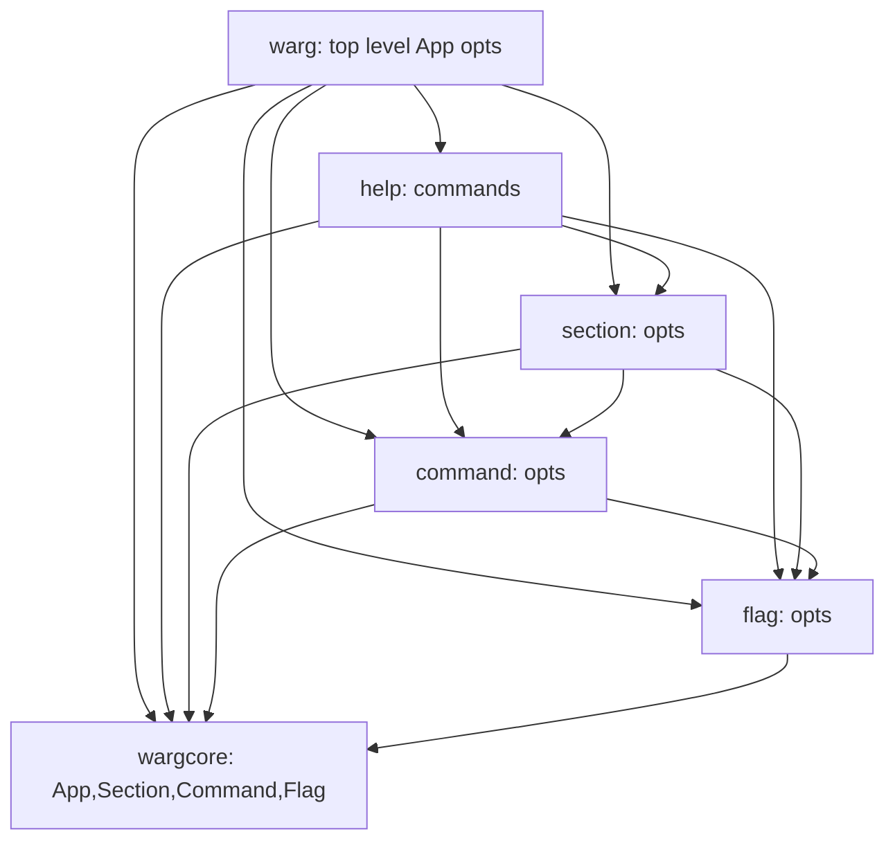

# Changelog

All notable changes to this project will be documented in this file. The format
is based on [Keep a Changelog](https://keepachangelog.com/en/1.0.0/).

Note that I update this changelog as I make changes, so the top version (right
below this description) is likely unreleased.

# v0.0.37

## Added

- Added `go.bbkane.com/warg/set` package with a basic set implementation

## Changed

- Updated `ParseState` to use `set.Set[string]` instead of the private `unsetFlagNameSet`
- Renamed `FlagValueMap` to `ValueMap` and added `IsSet` method

# v0.0.36

## Changed

Changed the following completions func to return a `CompletionsFunc` instead of implementing it directly. This groups them nicely in the docs and "standardizes" usage with Completion func generators that take args like `CompletionsValues`. It might be a performance hit, but I haven't noticed?

Example usage change: `warg.Completions(CompletionsDirectories)` -> `warg.Completions(CompletionsDirectories())`

- `CompletionsDirectoriesFiles`
- `CompletionsDirectories`
- `CompletionsNone`

Similar changes:

- `UnimplementedCmd` -> `Unimplemented()` (it now returns an `Action` instead of implementing one)

Renames:

- `DefaultHelpCommandMap` -> `DefaultHelpCmdMap`
- `ExpectingArg` -> `ParseArgState`
- `Section.Commands` -> `Section.Cmds`
- `SkipCompletionCommands` -> `SkipCompletionCmds`
- `SkipVersionCommand` -> `SkipVersionCmd`

## Removed

Removed / made private the following API functions

Help functions

- `AllCommandsSectionHelp`
- `CmdHelp`
- `DetailedCommandHelp`
- `DetailedSectionHelp`
- `FmtCommandName`
- `FmtFlagAlias`
- `FmtFlagName`
- `FmtHeader`
- `FmtSectionName`
- `HelpToCommand`
- `Helpinfo`
- `LeftPad`
- `OutlineCommandHelp`
- `OutlineSectionHelp`
- `SectionHelp`
- `SortedKeys`

Section iteration (I think I'm the only one using it and it's cluttering the public API):

- `FlatSection`
- `Section.BreadthFirst`
- `SectionIterator`

Other functions

- `CmdCompletions`
- `DefaultCmdCompletions`
- `DefaultFlagCompletions`

The `config/tokenize` package

# v0.0.35

## Changed

This version combines the following packages into the `warg` package:

- All `help/*` packages
- `command`
- `flag`
- `parseopt`
- `section`
- `wargcore`

To avoid name collisions and because it felt right, the following symbols were renamed (hope I didn't miss any):

<details>

| Old                        | New                          |
|----------------------------|------------------------------|
| command.CommandOpt         | warg.CmdOpt                  |
| command.Completions        | warg.CmdCompletions          |
| command.DefaultCompletions | warg.DefaultCmdCompletions   |
| command.DoNothing          | warg.UnimplementedCmd        |
| command.Flag               | warg.CmdFlag                 |
| command.FlagMap            | warg.CmdFlagMap              |
| command.Footer             | warg.CmdFooter               |
| command.HelpLong           | warg.CmdHelpLong             |
| command.New                | warg.NewCmd                  |
| command.NewFlag            | warg.NewCmdFlag              |
| flag.Completions           | warg.FlagCompletions         |
| flag.New                   | warg.NewFlag                 |
| parseopt.Args              | warg.ParseWithArgs           |
| parseopt.Context           | warg.ParseWithContext        |
| parseopt.LookupEnv         | warg.ParseWithLookupEnv      |
| parseopt.Stderr            | warg.ParseWithStderr         |
| parseopt.Stdout            | warg.ParseWithStdout         |
| section.Command            | warg.SubCmd                  |
| section.CommandMap         | warg.SubCmdMap               |
| section.Footer             | warg.SectionFooter           |
| section.HelpLong           | warg.SectionHelpLong         |
| section.New                | warg.NewSection              |
| section.NewCommand         | warg.NewSubCmd               |
| section.NewSection         | warg.NewSubSection           |
| section.Section            | warg.SubSection              |
| section.SectionMap         | warg.SubSectionMap           |
| wargcore.Command           | warg.Cmd                     |
| wargcore.CommandHelp       | warg.CmdHelp                 |
| wargcore.CommandMap        | warg.CmdMap                  |
| wargcore.Context           | warg.CmdContext              |

</details>

## Justification

Why do this? First, let me explain some things about the previous architecture of warg:

warg has a few "structural types" that form the basis of any app - `App`, `Command` (now `Cmd`), `Section`, `Flag`. On top of that warg has several instantiations/references of/to these types: `help` functions return `Commands` (and when creating an app (`warg.New`) you need to set the default help function) , `Context` (now `Cmd.Context`)  has references to basically all of these types and is used for tab completion, parsing, and executing commands. So there's a lot of cycles between type references. I would prefer a nice heirachical package structure, so previous versions of warg contorted these packages into the following structure:



The types that reference each other were in the `wargcore` package, and other packages carefully layered on top options to build an app - sometimes with conflicting names - `section.HelpLong` vs `command.HelpLong`.

Unfortunately, structuring the package imports like this has its own drawbacks:

A user has to import like 5 packages to build an app (6 if they want to customize `--help`) and more if they want to use non-scalar flags:

```go
import (
	"go.bbkane.com/warg"
	"go.bbkane.com/warg/command"
	"go.bbkane.com/warg/flag"
	"go.bbkane.com/warg/section"
	"go.bbkane.com/warg/value/scalar"
	"go.bbkane.com/warg/wargcore"
)
```

Not a great user experience - this is just boilerplate and can be hard to discover, autocomplete, or read docs for.

Secondly, these "provide options for `wargcore` types packages" (`flag`, `command`, `section`, `warg`, ect.) couldn't access private variables in the `wargcore` types, so I ended up making basically everything public in `wargcore`.

Combining these into one package, `warg`, fixes these issues, but introduces issues of its own - name conflicts. Hence all the renaming and shortening of names ( `Command` -> `Cmd`).

Fortunately, AI should make migration pretty easy. Just point Copilot at this CHANGELOG table above and ask it to make the changes. That's one reason why I put so much work into the table :sweat_smile:.

Now that most things are in one package, I plan to privatize public APIs my CLIs aren't using, and maybe do some more renames, but I figured I should cut a version first.

# v0.0.34

## Added

- Added `warg.FindVersion` to calculate the version of the app. Useful if you need the version before starting the app (particularly for setting up OTEL tracing)

Added new completion convenience functions instead of making folks manually construct a `wargcore.CompletionsFunc` (also see "Changed" section)

- Added `warg.CompletionsDirectories`
- Added `warg.CompletionsDirectoriesFiles`
- Added `warg.CompletionsNone`
- Added `warg.CompletionsValues`
- Added `warg.CompletionsValuesDescriptions`


As I've noticed I basically want a `--color` flag, a `version` subcommand, and zsh completions in all of my apps, this version of warg adds them automatically. Use `warg.SkipXxx` if you don't want them or want to write your own customized version.

Full list:

- Added `warg.SkipAll` to skip adding the `completion` section, the `--color` global flag, the `version` root command, and validation on start up. This is intended for tests where you just want to assert against a minimal application.
- Added `warg.SkipCompletionCommands` to let folks customize shell completions (currently only `zsh`) or avoid adding them. By default a root level `completion` section will be added. Currently only has `zsh` subcommand.
- Added `warg.SkipGlobalColorFlag` to skip adding the default `--color` flag automatically. Removed `warg.ColorFlagMap`
- Added `warg.SkipVersionCommmand` to skip adding the version root command automatically. Removed `warg.VersionCommandMap`

## Changed

Changed `s/CompletionCandidates/Completions` for all warg functions

- `command.DefaultCompletionsCandidates` -> `command.DefaultCompletions`
- `comand.CompletionCandidates` -> `command.Completions`
- `flag.DefaultCompletionsCandidates` -> `flag.DefaultCompletions`
- `flag.CompletionCandidates` -> `flag.Completions`
- `wargcore.App.CompletionCandidates` -> `wargcore.App.Completions`
- `wargcore.CompletionCandidatesFunc` -> `wargcore.CompletionsFunc`

## Removed

- Removed `warg.ColorFlagMap` and `warg.VersionCommandMap`. See description in the "Added" section

# v0.0.33

## Changed

- Renamed `Completions` to `CompletionsFunc`

## Fixed

Allow `--flag ""` to be passed (this previously unset the flag)

# v0.0.32

# Added

- Suggest "true"/"false" if the flag type is a bool

# v0.0.31

## Changed

- `zsh` completion script generation changed from `<app> --completion-script-zsh` to `<app> completion zsh` to make Homebrew generation easier

## Fixed

- comment out completion log printing
- Don't allow newlines in completions

# v0.0.30

## Added

- Expand tab completion to directory completion, directory + file completion, values completion, values+descriptions completion, and "None" completion (i.e., no results).
- Allow user-specified completion overriding and default completion funcs

## Changed

- updated `warg.ConfigFlag` to now simply take a reader and a flagmap
- Made help functions regular commands. Renamed `OverrideHelpFlag` to `HelpFlag` and made its signature much easier.
- Moved "core" types (App, Section, Command, Flag, HelpInfo) to a new "wargcore" package so they can reference each other, particularly for better tab completion. I'm not particularly happy with a giant package like this, but it's working.
- `wargcore.Context` now has a reference to the `App` and the `ParseResult`. As a result, I was able to remove `Path` and simplify help.
- `help` functions are now normal commands. I currently have a "translation" layer to the old style of help functions, but those should be removed shortly.

List of type changes after working more on parsing:

- `SectionT` -> `Section`
- `ParseResult2` -> `ParseState`
- `SectionMapT` -> `SectionMap`
- `ParseState` -> `ExpectingArg`
- `ParseOptHolder` -> `ParseOpt` and updated constructor name.
- removed `type FlagValue` (it's unused)
- made `unsetFlagNameSet` private

- Moved ParseOpts into their own package and renamed them:

- `wargcore.AddContext` -> `parseopt.Context`
- `wargcore.OverrideArgs` -> `parseopt.Args`
- `wargcore.OverrideLookupFunc` -> `parseopt.LookupEnv`
- `wargcore.OverrideStderr` -> `parseopt.Stderr`
- `wargcore.OverrideStdout` -> `parseopt.Stdout`

- Make `--help outline` only show sections and commands (not help or flags)

# v0.0.29

## Added

- Basic `zsh` tab completion!! Sections and commands and flag names complete just fine, but completion is only triggered on flag values if its value has `Choices`. More complex flag value completion (file/directory, dynamic from other flag values) is on the way, but will require a large "package flattening" refactoring to avoid circular imports. I'm also punting on tests until this refactor...

Assuming `~/fbin` is on the `zsh` `$fpath`, run:

```zsh
$ ./butler "completion zsh" > ~/fbin/_butler
```

- Added `scalar.PointerTo` to bind how a scalar updates from flags/interfaces to a pre-existing variable. Still need to do this for dicts and slices

and restart the shell

# v0.0.28

## Added

- `section.CommandMap` and `section.SectionMap` for pre-existing sections and commands

## Changed

- Changed `warg.VersionCommand` to `warg.VersionCommandMap` and `warg.ColorFlag` to `warg.ColorFlagMap`. This somewhat standardizes the name.
- Renamed `command.ExistingFlags` to `commamd.FlagMap` and `warg.ExistingGlobalFlags` to `warg.GlobalFlagMap`. The plural name is awkward when adding a one-element `FlagMap` is perfectly ok (and nice when you don't want to keep typing the name...) (see below)
- Renamed `Xxx` option functions to `NewXxx` (see below)
- Renamed `ExistingXxx` functiosn to `Xxx` (see below)
- `version` is now a parameter to `warg.New` instead of the (now removed)
`warg.OverrideVersion`. Changed because I ALWAYS want to set the version and I
think thats common for real-world CLIs. If passed an empty string, warg will
attempt to use the go module version.

Since I've renamed these to be a bit more consistent, here's a summary:

For:

- `GlobalFlag` (as an `AppOpt`)
- `Section` (as a `SectionOpt`)
- `Command` (as a `SectionOpt`)
- `Flag` (as a `CommandOpt`)

The syntax is:

| Name      | Purpose                                                      | Examples                                | Notes                                                |
| --------- | ------------------------------------------------------------ | --------------------------------------- | ---------------------------------------------------- |
| `xxx.New` | Create a new  standalone `Xxx`  (i.e.,without adding it as a named child) | `section.New(...)`                      | `xxx` is the package name of the object              |
| `NewXxx`  | Create a new named child `Xxx` (usually with a name) and forward remaining arguments to `xxx.New`. | `section.NewCommand("myname", ...)`     | Formerly named `Xxx` (changed in `v0.0.28`)          |
| `Xxx`     | Attach an existing `Xxx`  as a named child                   | `section.Command("mycommand", command)` | Formerly named `ExistingXxx` (changed in `v0.0.28`)  |
| `XxxMap`  | Attach an existing map of name to `Xxx` as named children    | `section.CommandMap(commandMap)`        | Formerly named `ExistingXxxs` (changed in `v0.0.28`) |

# v0.0.27

## Removed

- Removed `WARG_PRE_V0_0_26_PARSE_ALGORITHM` environment variable and the associated parse algorithm. We're 500 lines of code simpler now!

# v0.0.26

## Changed

- Moved `SetBy` into the `Value` interface (`value.UpdatedBy()` - this allows
`Flag` to be readonly and and makes the coupling between setting the value and
updating `UpdatedBy` explicit
- Flags must now be the last things passed - i.e. `<appname> <section>
<command> <flag>...`. In addition, the only flag allowed after a `<section>` is
the `--help` flag (unfortunately the `--color` flag is NOT currently allowed to
be passed for section help). This simplifies the parsing and will help with tab
completion, and after that's implemented I might try to restore the old
behavior if I get too annoyed with this limitation. Temporarily, the old
behavior can be restored by setting the `WARG_PRE_V0_0_26_PARSE_ALGORITHM`
environment variable, but I plan to remove that in the next version.

Examples:

```
$ go run ./examples/butler --color false -h
Parse err: Parse args error: expecting section or command, got --color
exit status 64
```

```
$ WARG_PRE_V0_0_26_PARSE_ALGORITHM=1 go run ./examples/butler --color false -h
A virtual assistant
# ... more text ...
```

# v0.0.25

## Added

- `path.Path` type that users should call `Expand`/`MustExpand` on. See `Removed`

## Changed

- The signature of `value.EmptyConstructor` no longer has the opportunity to
return an error. I don't think anything ever returned an error, so this was
never needed.

## Removed

- Removed `value.FromInstance`. This is a **nasty silent breaking change**
because it'll break users at runtime (not compile time) when they update
`warg`. However, `value.FromInstance` was only used for expanding `~` in
`Path`'s from default values - no other value types needed it. It also wasn't
really testable since the value `~` expanded to is different per machine
(without env var shennanigans). I'm replacing it with a `Path` type that the
user is expected to call `Path`/`MustExpand` on.

Old:

```go
path := cmdCtx.Flags["--mypath"].(string)
```

New:

```go
path := cmdCtx.Flags["--mypath"].(path.Path).MustExpand()
```

# v0.0.24

This is the start of some big changes to `warg`. I'm doing this mostly to make
adding tab completion a lot easier, but also because I've spent a few years
with `warg` now and I think I can simplify a few things.

I'm making sure all the tests pass, but I'm making enough changes to enough
code I no longer remember the exact context for that I'm sure I'll have to make
some bugfix releases. I think this is acceptable because I'm the only user of
this library and I think it'll be faster overall with my limited time and
energy.

I'm marking each breaking change with a new version so I can update piecemeal
or all at once.

## Changed

- Removed section flags in favor of app global flags. This is strictly less
  flexible than section flags, but paves the way to building easier tab
  completion, and it's easy use existing flags in multiple commands if they
  don't need to be global.

# v0.0.23

## Changed

- make `warg.GoldenTest` use `GoldenTestArgs` and `ParseOpt`s

# v0.0.22

## Changed

- make `warg.GoldenTest` accept `ParseOpt`s instead of a hardcoded list of options

# v0.0.21

## Added

- `command.Context`: `Version`, `AppName`, `Path` fields. Justification: I want
  to pass these fields to OpenTelemetry in `starghaze`.
- `command.Context.Context` field: Justification: I want to smuggle mocks into
  my `command.Action`s when testing. Before, this, I added an ugly "mock
  selection" flag, and this is much cleaner.

## Changed

- move `warg.ParseResult.Path` to `command.Context.Path`.
- rm `warg.AddVersionCommand()` in favor of `warg.VersionCommand()`. Use with
  `section.ExistingCommand("version", warg.VersionCommand()),`. Justification:
  more declarative - I'd like to define all commands inside the root section
  instead of having another way to add a flag as a warg option.
- rm `warg.AddColorFlag()` in favor of `warg.ColorFlag()`. Use with
  `section.ExistingFlag("--color", warg.ColorFlag()),`. Same justification as
  `warg.VersionCommand()`.
- update `Parse()` to use `ParseOpt`s instead of positional args:
  `OverrideArgs`, `OverrideLookupFunc`. Justification: these have obvious
  defaults that only need overriding for tests, which also probably want to use
  other `ParseOpt`s.
- move `warg.OverrideStderr` and `warg.OverrideStdout` to be `ParseOpt`s
  instead of `AppOpt`s. Justification: This removes the need for these public
  fields in `App` and nicer for callers.

# v0.0.20

## Fixed

- Fix YAML config parsing for `value.Dict`

# v0.0.19

## Fixed

- Fix panic when using a `value.Dict` and calling `detailed.DetailedCommandHelp`

# v0.0.18

## Added

- `contained.Addr` and `contained.AddrPort`
- `flag.UnsetSentinel` to allow for unsetting flags
- `value.Dict` container
- `warg.GoldenTest`
