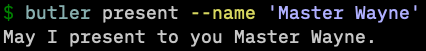

# warg

Build hierarchical CLI applications with warg!

- warg uses [funcopt](https://dave.cheney.net/2014/10/17/functional-options-for-friendly-apis) style declarative APIs to keep CLIs readable (nested commands can be indented!) and terse. warg does not require code generation.
- warg is extremely interested in getting information into your app. Ensure a flag can be set from an environmental variable, configuration file, or default value by adding a single line to the flag declaration (configuration files also take some app-level config).
- warg is customizable. Add new types of flag values, config file formats, or --help outputs using the public API.
- Warg is easy to integrate into or remove from an existing codebase. This follows mostly from warg being terse and declarative. If you decide to remove warg, simply remove the app declaration and turn the passed flags into other types of function arguments for your command handlers. Done!

## Examples

Full code for this example at [./examples/butler/main.go](./examples/butler/main.go). Also see the  [godocs examples](https://pkg.go.dev/go.bbkane.com/warg#pkg-examples) and other apps in [the examples directory](./examples/).

```go
	app := warg.New(
		"butler",
		section.New(
			section.HelpShort("A virtual assistant"),
			section.Command(
				"present",
				"Formally present a guest (guests are never introduced, always presented).",
				present,
				command.Flag(
					"--name",
					"Guest to address.",
					scalar.String(),
					flag.Alias("-n"),
					flag.EnvVars("BUTLER_PRESENT_NAME", "USER"),
					flag.Required(),
				),
			),
			section.Command("version", "Print version", command.PrintVersion),
		),
	)
```

## Run Butler

Color can be toggled on/off/auto with the `--color` flag:

<p align="center">
  
</p>

The default help for a command dynamically includes each flag's **current** value and how it was was set (passed flag, config, envvar, app default).

<p align="center">
  
</p>

Of course, running it with the flag also works

<p align="center">
  
</p>

## Apps Using Warg

- [fling](https://github.com/bbkane/fling/) - GNU Stow replacement to manage my dotfiles
- [grabbit](https://github.com/bbkane/grabbit) - Grab images from Reddit
- [starghaze](https://github.com/bbkane/starghaze/) - Save GitHub Starred repos to GSheets, Zinc

# Should You Use warg?

I'm using warg for my personal projects, but the API is not finalized and there
are some known issues (see below). I will eventually improve warg, but I'm currently ( 2021-11-19 )
taking a break from developing on warg to develop some CLIs with warg.

## Known Issues / Design Tradeoffs

- lists containing aggregate values ( values in list objects from configs ) should be checked to have the same size and source but that must currently be done by the application ( see [grabbit](https://github.com/bbkane/grabbit/blob/d1f30b87c4e5c8112f08e9889fa541dbeab66842/main.go#L311) )
- By design, warg does not support positional arguments. Instead, use required flags. See "Unsupported CLI Patterns" below.
- By design, warg requires at least one subcommand. This makes adding additional subcommands easy. See "Unsupported CLI Patterns" below.

## Alternatives

- [cobra](https://github.com/spf13/cobra) is by far the most popular CLI framework for Go. It relies on codegen.
- [cli](https://github.com/urfave/cli) is also very popular.
- I've used the now unmaintained [kingpin](https://github.com/alecthomas/kingpin) fairly successfully.

# Concepts

## Sections, Commands, Flags, and Values

warg is designed to create hierarchical CLI applications similar to [azure-cli](https://github.com/Azure/azure-cli) (just to be clear, azure-cli is not built with warg, but it was my inspiration for warg). These apps use sections to group subcommands, and pass information via flags, not positional arguments. A few examples:

### azure-cli

```
az keyvault certificate create --name <name> --vault-name <vault-name> --tag <key1=value1> --tag <key2=value2>
```

If we try to dissect the parts of this command, we see that it:

- Starts with the app name (`az`).
- Narrows down intent with a **section** (`keyvault`). Sections are usually nouns and function similarly to a directory hierarchy on a computer - used to group related sections and commands so they're easy to find and use together.
- Narrows down intent further with another **section** (`certificate`).
- Ends with a **command** (`create`). Commands are usually verbs and specify a single action to take within that section.
- Passes information to the command with **flags** (`--name`, `--vault-name`).
- Each flag is passed exactly one **value** (`<name>`, `<vault-name>`, and `<key=value` are placeholders for user-specified values). A flag can be typed multiple times to build aggregate data structures like slices or maps.

This structure is both readable and scalable. `az` makes hundreds of commands browsable with this strategy!

### grabbit

[grabbit](https://github.com/bbkane/grabbit) is a much smaller app to download wallpapers from Reddit that IS built with warg. It still benefits from the sections/commands/flags structure. Let's organize some of grabbit's components into a tree diagram:

```
grabbit                   # app name
├── --color               # section flag
├── --config-path         # section flag
├── --help                # section flag
├── config                # section
│   └── edit              # command
│       └── --editor      # command flag
├── grab                  # command
│   └── --subreddit-name  # command flag
└── version               # command
```

Similar to `az`, `grabbit` organizes its capabilities with sections, commands and flags. Sections are used to group commands. Flags defined in a "parent" section are available to child commands. for example, the `config edit` command has access to the parent `--config-path` flag, as does the `grab` command.

## Populating Values

Values can be populated from **app defaults**, and these can be overridden by **environmental variables**, and these can be overridden by values read from a **config** , and, finally, these can be overriden by values passed when invoking the app on the command line via **CLI flags**.

Specify type-independent options to populate values with [`FlagOpt`](https://pkg.go.dev/github.com/bbkane/warg/flag#FlagOpt)s and type-specific value options with options specific to each type of value (such as slices or scalars).

See an [example](./example_flag_value_options_test.go).

## Specially Handled Flags

### `--config`

Because warg has the capability to read values from a config file into the app, and then override those values from other sources, a`--config` flag must be parsed *before* other flags.  See [the docs](https://pkg.go.dev/github.com/bbkane/warg#ConfigFlag) for API and an example.

### `--help` and  `--color`

As a special case, the`--help/-h` flag may be passed without a value. If so, the default help action will be taken. See [`OverrideHelpFlag`](https://pkg.go.dev/github.com/bbkane/warg#OverrideHelpFlag) and its example for how to change the default help action. By convention, the built-in help commands look for a flag called `--color`  to control whether `--help` prints to the terminal in color. Use `AddColorFlag` to easily add this flag to apps and  [`ConditionallyEnableColor`](https://pkg.go.dev/github.com/bbkane/warg/help#ConditionallyEnableColor) to easily look for this flag in custom help.

## Unsupported CLI Patterns

One of warg's tradeoffs is that it insists on only using sections, commands,  flags, and values. This means it is not possible (by design) to build some styles of CLI apps. warg does not support positional arguments. Instead, use a required flag: `git clone <url>` would be `git clone --url <url>`.

All warg apps must have at least one nested command.  It is not possible to design a warg app such that calling `<appname> --flag <value>` does useful work. Instead, `<appname> <command> --flag <value>` must be used.

