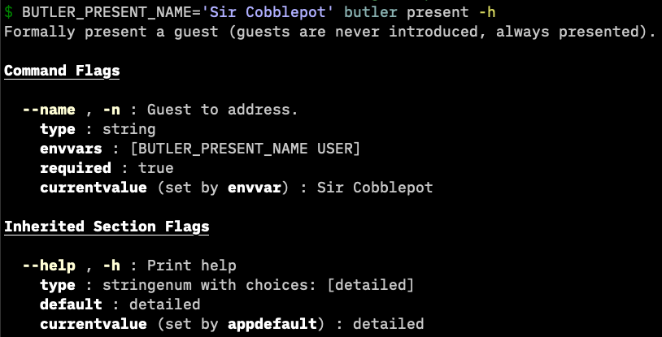

# warg

An opinionated CLI framework:

- declarative nested commands
- Detailed `--help` output (including what a flag is currently set to)
- update flags from `os.Args`, config files, environment variables, and app defaults
- extend with new flag types, config file formats, or `--help` output
- snapshot testing support

# Project Status (2025-01-24)

The "bones" of warg are where I want them, but I have several breaking changes I'd like to try before considering warg stable. None of them will change the basic way warg works, and I haven't had a lot of trouble updating my apps using warg. See the [CHANGELOG](./CHANGELOG.md) for past breaking changes.

# Examples

All of the CLIs [on my profile](https://github.com/bbkane/bbkane) use warg.

See API docs (including code examples) at [pkg.go.dev](https://pkg.go.dev/go.bbkane.com/warg)

Simple "butler" example (full source [here](examples/butler/main.go)):

```go
app := warg.New(
  "butler",
  "v1.0.0",
  section.New(
    section.HelpShort("A virtual assistant"),
    section.NewCommand(
      "present",
      "Formally present a guest (guests are never introduced, always presented).",
      present,
      command.NewFlag(
        "--name",
        "Guest to address.",
        scalar.String(),
        flag.Alias("-n"),
        flag.EnvVars("BUTLER_PRESENT_NAME", "USER"),
        flag.Required(),
      ),
    ),
    section.CommandMap(warg.VersionCommandMap()),
  ),
  warg.GlobalFlagMap(warg.ColorFlagMap()),
)
```

<p align="center">
  
</p>

# When to avoid warg

By design, warg apps have the following requirements:

- must contain at least one subcommand. This makes it easy to add further subcommands, such as a `version` subcommand.   It is not possible to design a warg app such that calling `<appname> --flag <value>` does useful work. Instead, `<appname> <command> --flag <value>` must be used.
- warg does not support positional arguments. Instead, use a required flag: `git clone <url>` would be `git clone --url <url>`. This makes parsing much easier, and I like the simplicity of it.

# Alternatives

- [cobra](https://github.com/spf13/cobra) is by far the most popular CLI framework for Go.
- [cli](https://github.com/urfave/cli) is also very popular.
- I haven't tried [ff](https://github.com/peterbourgon/ff), but it looks similar to warg, though maybe less batteries-included
- I've used the now unmaintained [kingpin](https://github.com/alecthomas/kingpin) fairly successfully.

